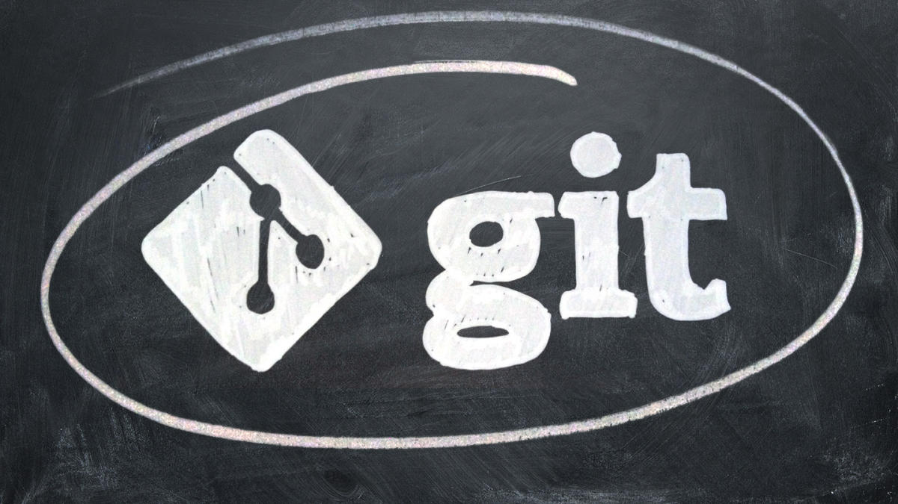
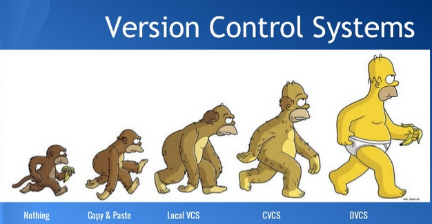
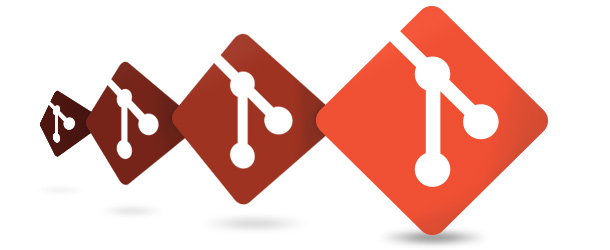
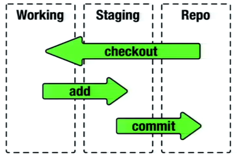
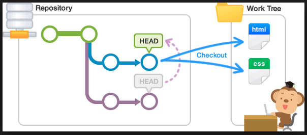
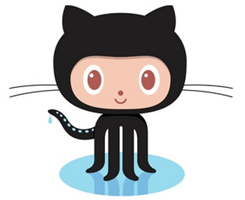
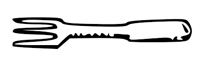
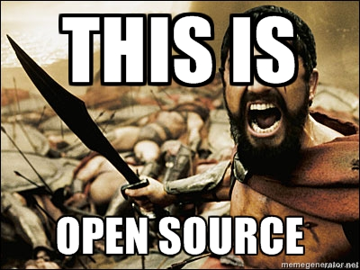

!SLIDE center
## Começando com:
#  
por Helio Oliveira
<div class="shivs">Grupo de estudo HTML5</div>

!SLIDE center bullets incremental transition=fade
# About Me:
* Usuário Unix desde 2000
* Amante de Tecnologia
* Cursando Análise e Desenvolvimento de Sistemas
* heliohead
* heliohead

!SLIDE bullets incremental transition=wipe
# Preferências
* 
* 
* Sinatra, Rails, Node

!SLIDE bullets  incremental transition=curtainX
# Iremos aprender:
* O que é, e para que serve o Git
* Como instalar o GIT
* Comandos básicos
* O que é GitHub e um overview do serviço

!SLIDE bullets  incremental transition=curtainY
# 

!SLIDE bullets  incremental transition=curtainY
# 

!SLIDE bullets  incremental transition=scrollUp
# O que é, e para que serve o Git

Git é um [VCS](https://en.wikipedia.org/wiki/Revision_control) = Version Control System, Sistema de controle versão, existem dois tipos de VCS, os centralizados e os distribuídos, o [Subversion ou SVN](https://subversion.apache.org/) é centralizado enquanto [GIT](https://git-scm.com/) e
[Mercurial](https://mercurial.selenic.com/) são distribuídos, isso quer dizer que nos VCS centralizados um servidor central é requirido e todos os commits são enviados para este repositório central, nos sistemas distribuídos cada desenvolvedor tem uma cópia (clone) do projeto inteiro e comita em sua cópia local, e pode enviar para um servidor remoto suas alterações que por sua vez é compartilhada com outros desenvolvedores.

!SLIDE bullets  incremental transition=fadeZoom


Git foi escrito em 2005 por [Linus Torvalds](https://en.wikipedia.org/wiki/Linus_Torvalds) por conta de sua insatisfação com o [CVS](http://www.nongnu.org/cvs/) e [BitKeeper](http://www.bitkeeper.com/), no versionamento do kernel do Linux, [este](https://www.youtube.com/watch?v=4XpnKHJAok8) é o link para um talk do Linus explicando do jeito Linus de ser suas motivações para começar este novo projeto.

O nome GIT é uma gíria Inglesa para cabeça dura ツ
>Eu sou um egoísta degenerado, batizo todos os meus projetos com meu nome. Primeiro Linux, agora Git.
>"Linus Torvalds"

!SLIDE bullets  incremental transition=shuffle
# Como instalar o Git

* No Windows <br />
<br />
Eu indico [msysgit](http://msysgit.github.io/) que prove um emulador BASH para melhor utilizaçao do command line <3

* No Lixux <br />
<br />
É só utilizar os pacotes de sua distro favorita [apt](http://linux.die.net/man/8/apt-get), [rpm](http://www.rpm.org/max-rpm/ch-rpm-install.html), [pacman](https://wiki.archlinux.org/index.php/Pacman)

* No OSX <br/>
<br />
```
$ brew install git
```
* Ou baixar do site [oficial](https://git-scm.com/downloads)

!SLIDE bullets  incremental transition=turnUp
# Como funciona o Git


!SLIDE bullets  incremental transition=uncover
# Stage


* Git funciona com o conceito de stage, um aquivo novo inserido no diretório iniciado com com Git, precisa ser colocado em stage antes de ser commitado efetivamente, se não, o Git não vai se importar com ele e as alterção não serão contabilizadas, do mesmo modo você pode retirar um arquivo da área de stage que não deseja mais ser monitorado.


!SLIDE bullets incremental transition=toss
# Branches


* Git trabalha com conceito de [branches](https://git-scm.com/book/pt-br/v1/Ramifica%C3%A7%C3%A3o-Branching-no-Git-B%C3%A1sico-de-Branch-e-Merge), como uma árvore com vários galhos, um commit seria como uma folha, no galho, sendo que você pode unir os galhos com um [merge](https://git-scm.com/book/pt-br/v1/Ramifica%C3%A7%C3%A3o-Branching-no-Git-B%C3%A1sico-de-Branch-e-Merge) as folhas passam a pertencer ao mesmo galho e também alterar a ordem das folhas com um [rebase](https://git-scm.com/book/pt-br/v1/Ramifica%C3%A7%C3%A3o-Branching-no-Git-Rebasing).


!SLIDE commandline  incremental transition=zoom
# Comandos
```
$ git config --global user.name <name>
```

* Configura o nome do usuário na configuração global

```
$ git config --global user.email <email@email.org>
```

* Configura o email do usuário na configuração global

```
$ git init myAlwesomeSoftware
```

* Cria um diretório com o nome myAlwesomeSoftware com outro diretório de nome .git/ dentro, contendo as configurações necessárias, ou git init sem argumento para iniciar o git em um diretório já existênte

!SLIDE commandline  incremental transition=curtainY
# Comandos
```
$ git add .
```

* Adiciona todos os arquivos do diretório em stage

```
$ git status
```

* Mostra o quais arquivos estão modificados, em stage ou não

```
$ git commit -m "my modification rules"
```

* O comando commit grava as alterações do stage no branch em uso a flag m, indica mensagem de commit

!SLIDE commandline  incremental transition=scrollRight
# Comandos
```
$ git branch
```

* Lista os branches existentes

```
$ git checkout <branch-name>
```

* Altera para o branch local

```
$ git checkout -b <new-branch-name>
```

* Cria um novo branch e altera para o branch criado

!SLIDE commandline  incremental transition=scrollVert
# Comandos
```
$ git clone <path-to-remote-repo> <optional-dir-name>
```

* Clona, ou seja, faz uma cópia local de um repositório remoto, você pode passar um nome diferente do diretório original como argumento

* [Aqui](https://git-scm.com/book/pt-br/v1) você enconta a documentação oficial

!SLIDE commandline  incremental transition=growY
# GUI - Ferramentas Visuais
Se você gosta de ferramentas GUI, a unica que utilizei uma vez foi o [SourceTree](https://www.sourcetreeapp.com/), da Atlassian empresa do BitBucket, mas existem várias como o [GitBox](http://www.gitboxapp.com/), [GitK](http://gitk.sourceforge.net/), [GitForce](https://sites.google.com/site/gitforcetool/home), muitos IDEs tem suporte a Git devendo somente instalar um plugin, pessoalmente prefiro a command line 💪 💕


!SLIDE center


!SLIDE commandline  incremental transition=scrollDown
# O que é GitHub e um overview do servico

* [GitHub](https://github.com/) é uma rede social de código, onde hoje a maioria dos código de projetos opensource estão hospedados, além de ser o maior repositório de códigos versionados em GIT, também é possivel hospedar códigos SVN, o serviço é grátis para opensource e há planos para repositórios privados, o [BitBucket](https://bitbucket.org/) é uma alternativa ao Github e aceita versinamentos em Git e Mercurial, com a diferença de não ter que pagar por repositórios privados, porém perde para o Github em relação a algumas [features](https://github.com/features), como o issue tracker, o [github pages](https://pages.github.com/), e code review colaborativo, você pode também criar seu próprio servidor de Git com o [GitLab](https://about.gitlab.com/), ou criar sua própria [solução](https://git-scm.com/book/pt-br/v1/Git-no-Servidor).
<br />


!SLIDE commandline  incremental transition=cover
# Workflow
No Github temos o seguinte workflow:

* Criar uma conta <br />
Ao cadastrarmos no Github devemos copiar uma senha [SSH](https://en.wikipedia.org/wiki/Secure_Shell) em sua conta, se você não tem uma crie a sua,  [unix](https://git-scm.com/book/pt-br/v1/Git-no-Servidor-Gerando-Sua-Chave-P%C3%BAblica-SSH), [windows](http://wiki.locaweb.com.br/pt-br/Como_configurar_uma_chave_p%C3%BAblica_no_Windows%3F), você pode usar uma conecão HTTPS também mas ficar colocando senha toda hora é bastante chato, a não ser que esteja em alguma rede que bloqueie a porta 22, padrão de acesso SSH.

* Criando o um repositório <br />
Depois de logado em sua conta há botão com o símbo de + no lado direito superior do site onde pode ser criado um novo repositório, é tudo bem fácil de usar, seu repositório sempre vai ter um endereço url como http://github.com/<your-login>/<repo>

!SLIDE commandline  incremental transition=scrollDown
# Workflow
```
$ git push origin master
```

* Com o comando push você envia seus commits para o repo remoto

```
$ git fetch
```
```
$ git fetch
```

* Com pull e fetch você atualiza o repo local [aqui](http://blog.mikepearce.net/2010/05/18/the-difference-between-git-pull-git-fetch-and-git-clone-and-git-rebase/) você encontra a diferença
    entre pull e fetch

!SLIDE commandline  incremental transition=zoom
# Social Coding


* Fork é um clone de um projeto na sua url do Github, esta forma o sistema tem como trackear suas alterções em comparação com o repositório original

!SLIDE commandline  incremental transition=fadeZoom
# Social Coding


* Pull Request de longe é a coisa mais legal do [OSS](https://en.wikipedia.org/wiki/Open-source_software), você resolve um bug ou adiciona uma feature em sua cópia local, envia para o repo remoto e se desejar que a alterção entre no repo original forkado é só apertar o botão de pull request, discutir o código no issue tracker e aguardar o mantenedor do projeto fazer o merge........ ou não rs.

!SLIDE commandline  incremental transition=scrollDown
# Social Coding


!SLIDE bullets incremental transition=fade


* ### That's it!

* ### for you!

!SLIDE center bullets incremental
# Obrigado!
* Espero que tenham gostado

!SLIDE center bullets
# Links
* Meu blog [http://blog.lio.pw](http://blog.lio.pw)
* Git [documentação](https://git-scm.com/documentation) oficial
* [Video](https://www.youtube.com/watch?v=4XpnKHJAok8) do Linus Torvalds sobre o Git

!SLIDE center bullets
# Perguntas?
